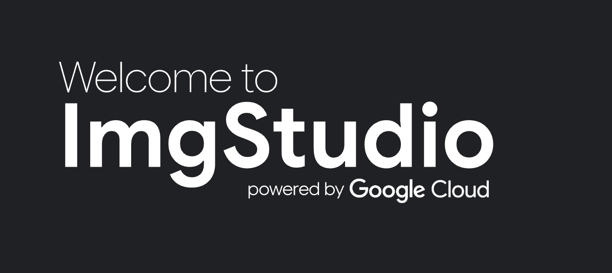
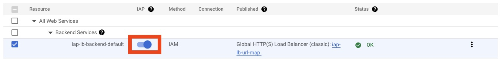

# ImgStudio


ImgStudio is a web tool to experiment with Google Cloud image generation models. 

## Infrastructure Setup Guide

### Pre-requisites

- Ensure required access to **Imagen models**
  - **For Imagen Generation:**
    - Models are now in public GA, **Imagen 3 Generate** (`imagen-3.0-generate-002`) and **Imagen 3 Generate Fast** (`imagen-3.0-fast-generate-001`)
    - **For people generation** (adult and/ or children), you now need to fill out [this form](https://docs.google.com/forms/d/e/1FAIpQLSduBp9w84qgim6vLriQ9p7sdz62bMJaL-nNmIVoyiOwd84SMw/viewform) to get access.
  - **For Imagen Editing & Customization**
    - You can fill out [this form](https://docs.google.com/forms/d/e/1FAIpQLScN9KOtbuwnEh6pV7xjxib5up5kG_uPqnBtJ8GcubZ6M3i5Cw/viewform) to get access to the Preview feature (name: `imagen-3.0-capability-001`)
    - You will also need the **Vertex Image Segmentation model** when using editing, fill out [this form](https://docs.google.com/forms/d/e/1FAIpQLSdzIR1EeQGFcMsqd9nPip5e9ovDKSjfWRd58QVjo1zLpfdvEg/viewform?resourcekey=0-Pvqc66u-0Z1QmuzHq4wLKg&pli=1) to get access (name: `image-segmentation-001`)
- Install the [Google Cloud CLI](https://cloud.google.com/sdk/docs/install)
- Authenticate with your user account: `gcloud auth login` (then follow login steps in the browser). You must have the `Project Creator` role or the `Project Editor` role on an existing project. We recommend you set up a new project for this. 
- Ensure that the following constraint is not set in the project:
  - `constraints/iam.disableServiceAccountCreation` (Justification: service accounts are created by the solution)

### 1: Run **boothstrap.sh** script
This script will confirm your target GCP project and configurations, enable necessary APIs, configure OAuth, create GCS Bucket (for Terraform state storage), artifact registry repository, and Cloud Build service account with the necessary permissions.

**How to Run**
From the project's root folder, run the script `bootstrap.sh`:

```
./bootstraph.sh
```

Only proceed to the next step if the script completed successfully.

### 2: Configure and run the build pipeline
The next step is to run a build pipeline (using Cloud Build) to deploy the app and infrastructure resources.

#### High Level Build Steps
  - Step-1: Build imgstudio docker image
  - Step-2: Push docker image to artifact registry
  - Step-3: Terraform init
  - Step-4: Terraform deploy
#### Necessary Parameters
  - You need to manually update these values inside your `cloudbuild.yaml` file
      - _IAP_ALLOWED_MEMBERS: The list of IAM members allowed to access the app. Use prefix user:, group:, or domain: for IAM users, groups, or domains, respectively. Example: `'["group:my-user-group@example.com", "user:admin-joe@example.com"]'`
      - _NEXT_PUBLIC_PRINCIPAL_TO_USER_FILTERS: Set this your company's domain using the following format: `',@example.com'`
      - _DOMAIN_NAME: If you plan on setting up a custom DNS name, set this value. Otherwise, leave it empty. If you need it empty, your app will be accessible through `<LB_IP_ADDRESS>.nip.io`. The LB_IP_ADDRESS will be shown in the output of the build logs.
  - See the `substitutions` part inside your `cloudbuild.yaml` file for details and additional variables you can optionally change.

#### How to Run

From the project's root folder, run :

```
gcloud builds submit . --config=cloudbuild.yaml
```

You can open the URL shown in the output to inspect the build logs. Look for the line `Logs are available at [ URL ]`


#### If you're not configuring a custom domain (If you're setting up a custom domain, move on the step #3)
Once the build has successfully completed, Run the following command to check the status of the SSL certificate provisioning:
```
gcloud compute ssl-certificates describe iap-lb-cert
```

Example output:
```
creationTimestamp: '2025-03-31T01:37:26.597-07:00'
id: '123456789'
kind: compute#sslCertificate
managed:
  domainStatus:
    34.55.25.140.nip.io: PROVISIONING
  domains:
  - 34.55.25.140.nip.io
  status: PROVISIONING
name: iap-lb-cert
selfLink: https://www.googleapis.com/compute/v1/projects/<project-id>/global/sslCertificates/iap-lb-cert
type: MANAGED
```

If it says `PROVISIONING`, wait a few minutes before running it again. Once provisioning is complete, you should see the status `ACTIVE`. It can take sometime for the SSL certificate to be provisioned. 

At this point, you can open a browser and navigate to the domain that ends in `nip.io` (in the above example, it's `34.55.25.140.nip.io`). 

**Note**: There is a known issue where you get an error message with error code 11 when accessing the app. To fix this, check the **Known Issues and Workarounds** section below.

### 3: [Optional] Configure DNS record for custom domain
In this step, you will create an A record that points your chosen domain name to the load balancer's IP address. Terraform will print out "external LB's IP address" in the cloud build logs. 

You can also inspect the external IP address with the following command:
```
gcloud compute forwarding-rules describe iap-lb --global --format='value(IPAddress)'
```

Copy the IP address, and navigate to your domain registrar to create an A record. You may need to request a network admin in your organization to do so.

#### Check SSL certificate provisioning status
An SSL certificate is created by Terraform using Google Cloud's Certificate Manager. For the certificate to be successfully provisioned by Google's certificate authority (CA), a DNS record must point the domain to the load balancer's IP. There is a polling mechanism to check if this has been set up, but it can take a while for changes to be reflected.

Once you've created the proper DNS record, run the following command to check the status:
```
gcloud compute ssl-certificates describe iap-lb-cert
```

If it says `PROVISIONING`, wait a few minutes before running it again. Once provisioning is complete, you should see the status `ACTIVE`. If provisioning failed, try running the Cloud Build pipelien again. This could happen if too much time has passed since the SSL certificate resource was deployed and the DNS record was created.

At this point, you can open a browser and navigate to the domain that ends in `nip.io` (in the above example, it's `34.55.25.140.nip.io`). 

**Note**: There is a known issue where you get an error message with error code 11 when accessing the app. To fix this, check the **Known Issues and Workarounds** section below.

## Enjoy it !
If everything run successfully you can now start using ImgStudio. We're working on a user guide for guidance and best practices. Stay tuned for an update.


## Known Issues and Workarounds
#### If you get the following error message while trying to access the app: There was a problem with your request. Please reference https://cloud.google.com/iap/docs/faq#error_codes. Error code 11

Do the following steps:
1. Navigate to the [IAP console](https://console.cloud.google.com/security/iap) 
2. Disable IAP by selecting the app and clicking on the toggle:



3. Wait a few seconds for the operation to complete and then click on the toggle again to re-enable it. Select the checkbox `I have read the configuration requirements  and configured my Backend Service according to documentation` and click on **Turn on IAP**
4. Wait a few seconds for the operation to complete and you should be able to access the app now.

If those steps don't solve the issue, please wait a few minutes before trying to access the app again.


> ###### _This is not an officially supported Google product. This project is not eligible for the [Google Open Source Software Vulnerability Rewards Program](https://bughunters.google.com/open-source-security)._